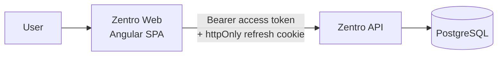
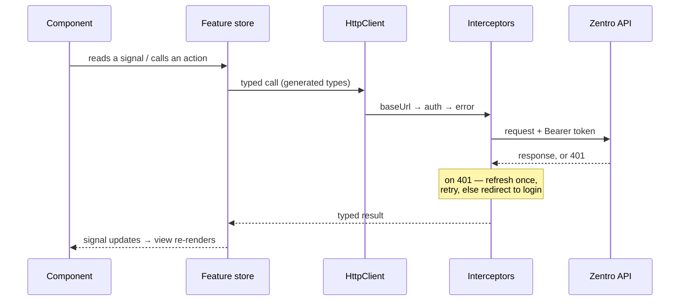

# Architecture — Zentro Web

How this app is put together and why. For file placement see
[docs/structure.md](./docs/structure.md); for decisions see [docs/adr/](./docs/adr/).

---

## 1. What this app is responsible for



**Rendering and interaction. Nothing else.**

Every rule that matters — authorization, split validity, balance arithmetic — lives in the
API. This app displays what the server returns and sends what the user asks for. A route
guard here exists so a logged-out user sees a login screen instead of an empty page; it is a
UX affordance, not a security boundary. Anyone can edit client state.

The practical consequence: **never move a check here to save a round trip**, and never trust
a number this app computed about money.

---

## 2. Layers

```
features/  ──▶  shared/  ──▶  core/
```

One direction. Never upward, never feature-to-feature. ESLint enforces it.

| Layer | Contains | Rule |
|---|---|---|
| **`core/`** | Singletons instantiated once: auth service and store, HTTP interceptors, generated API client, config, app shell, error handling | Imports nothing from `features/` or `shared/` |
| **`shared/`** | Dumb reusable pieces: `ui/` primitives, pipes, directives, pure utilities | **Injects no services.** Props in, events out. If it needs a service, it belongs in a feature. |
| **`features/`** | One folder per domain area — routed screens, feature services, feature-local components | May import `shared/` and `core/`. **Never another feature.** |

**Why feature-to-feature imports are banned:** they are how a codebase stops being
navigable. Once `expenses/` imports from `groups/`, neither can be understood or changed
alone, and the import graph becomes a ball of string. When two features genuinely need the
same thing, it moves to `shared/` (if dumb) or `core/` (if stateful).

### Smart vs dumb

- **Smart** components live in `features/`. They inject services, fetch data, own state.
- **Dumb** components live in `shared/ui/`. Inputs and outputs only, no injection, no
  knowledge of Zentro's domain. A `<z-money>` renders an amount; it does not know what an
  expense is.

---

## 3. State

**Signals, plus small injectable stores. No NgRx** — see
[ADR-0002](./docs/adr/0002-signals-over-ngrx.md).

The app is zoneless, so **change detection is driven entirely by signals**. A plain class
property mutated outside a signal will not trigger a re-render — and it fails silently,
which is the single most confusing bug a newcomer will hit here.

Three kinds of state, handled differently:

| Kind | Example | Where it lives |
|---|---|---|
| **Server state** | Groups, expenses, balances | A `resource()` in a feature store — the server is the source of truth, we cache a view of it |
| **Session state** | Current user, access token | `core/auth` store, app-lifetime |
| **Local UI state** | Is this modal open, which tab | A `signal` in the component. It does not belong in a store. |

Derived values are `computed()`, never recalculated by hand and never stored twice. A
balance shown in two places is one `computed()` read twice, not two fields kept in sync.

Details and patterns: [docs/state.md](./docs/state.md).

---

## 4. Data flow



Three interceptors, in order:

1. **Base URL** — turns a relative path into the configured API origin.
2. **Auth** — attaches the in-memory access token, and `withCredentials` so the refresh
   cookie is sent.
3. **Error** — normalizes the API's error envelope, and handles `401` by refreshing **once**
   and retrying. Concurrent 401s share one refresh rather than firing several.

A `401` is routine, not exceptional — access tokens last ~15 minutes. A *second* 401 means
the session is genuinely over.

---

## 5. Authentication

| | Where it lives | Why |
|---|---|---|
| **Access token** | Memory only — a signal in `core/auth` | `localStorage` is readable by any XSS payload. In memory, a page refresh loses it and the refresh cookie silently restores the session. |
| **Refresh token** | httpOnly cookie, set by the API | The client cannot read or touch it. That is the point. |

**Never put a token in `localStorage` or `sessionStorage`.** The current mock
`AuthService` does exactly this and is scheduled for replacement in M0.

On boot the app calls the refresh endpoint once. Success rehydrates the session; failure
means logged out. That is why a hard refresh doesn't log you out despite the token being
in memory.

---

## 6. Routing

Lazy-loaded standalone components throughout — every route is its own chunk, so the initial
bundle stays small and enforces the budgets in CI.

```ts
{
  path: 'groups/:id',
  loadComponent: () => import('./features/groups/group-detail/group-detail').then(m => m.GroupDetail),
  canActivate: [authGuard],
}
```

Guards are UX, not security (§1). Feature routes are defined in the feature folder and
composed into `app.routes.ts`, so adding a screen doesn't touch a shared file.

---

## 7. Styling

Tailwind v4 with a **`@theme` token layer**. Components use semantic tokens
(`bg-surface`, `text-muted`), never raw hex or arbitrary values.

The reason is dark mode and consistency: a raw `#3b82f6` in a component is invisible to the
theme, so it survives a palette change and breaks in dark mode. Tokens are the only thing
that makes a coherent redesign possible later.

Design tokens, scales and dark mode: [docs/styling.md](./docs/styling.md).

---

## 8. The API contract

Types are **generated from the backend's OpenAPI document, never hand-written**
([ADR-0004](./docs/adr/0004-generated-api-client.md)). `npm run api:sync` regenerates them;
CI fails if the committed output has drifted.

This is what makes the two-repo split survivable. Without it, a field renamed in the API
compiles cleanly here and fails in front of a user.

---

## 9. What this architecture deliberately does not have

Named so nobody re-litigates them without cause:

- **No SSR.** The app is behind a login: no SEO benefit, and server rendering actively
  fights cookie auth and browser APIs. [ADR-0001](./docs/adr/0001-drop-ssr-for-spa.md)
- **No NgRx.** Signals plus small stores cover this app's needs at a fraction of the
  ceremony. [ADR-0002](./docs/adr/0002-signals-over-ngrx.md)
- **No NgModules.** Standalone components only.
- **No component library.** Tailwind plus our own `shared/ui/` primitives — a library would
  fight the token layer and ship more than we use.
- **No client-side money arithmetic.** The server computes; we format.
